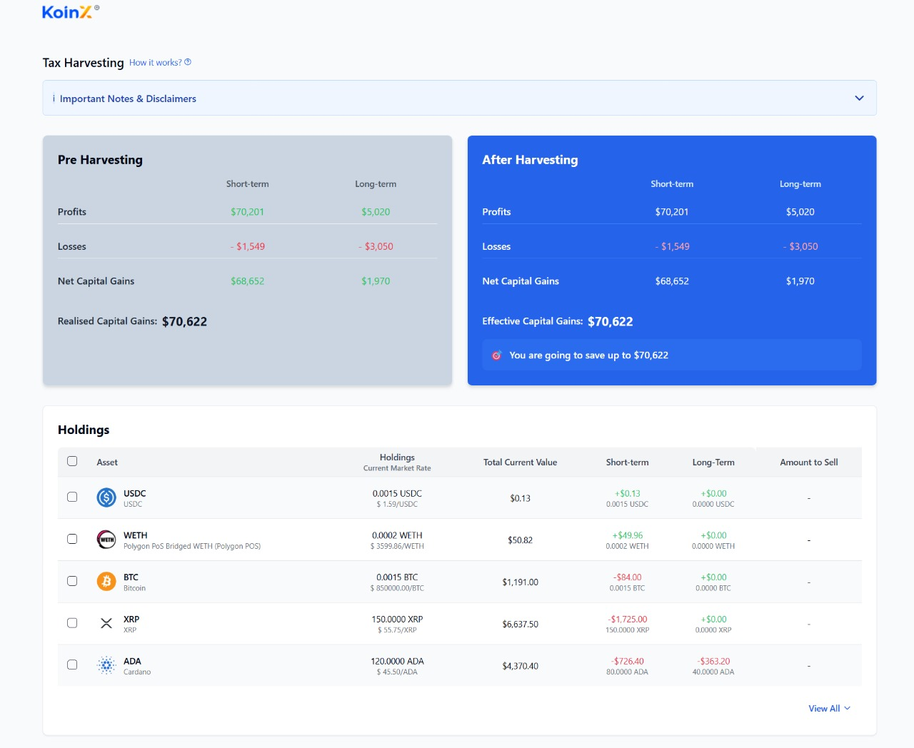

# 📉 Tax Loss Harvesting - KoinX Assignment



## Project Overview

This project implements a **Tax Loss Harvesting** tool that allows users to simulate how selling certain assets would impact their capital gains tax liability. Users can select assets they're considering selling and instantly see the effect on their **short-term** and **long-term** capital gains.

---

## 🚀 Technologies Used

- ⚛️ **React** – Frontend UI library
- 🟦 **TypeScript** – Type-safe JavaScript
- ⚡ **Vite** – Build tool and development server
- 🎨 **Tailwind CSS** – Utility-first CSS framework
- 🧩 **shadcn/ui** – UI component library
- 📊 **Recharts** – Charting library for visualization
- 🔍 **Lucide React** – Icon library
- 🔄 **React Query** – Data fetching and state management

---

## 🛠️ Setup Instructions

### 📋 Prerequisites

- Node.js (v16 or newer)
- npm or yarn package manager

### 📥 Installation

````bash
# 1. Clone the repo
git clone https://github.com/Ankit389/assignment--koinx.git

2. Navigate to the project directory:

   ```sh
   cd assignment--koinx
````

3. Install dependencies:

   ```sh
   npm install
   # or
   yarn install
   ```

4. Start the development server:

   ```sh
   npm run dev
   # or
   yarn dev
   ```

5. Open your browser and navigate to:
   ```
   http://localhost:8080
   ```

## Features

- **Capital Gains Overview**: See your current capital gains tax liability
- **Tax Loss Harvesting Simulation**: Select assets to sell and see how it affects your tax situation
- **Detailed Holdings Table**: View all your cryptocurrency holdings with profit/loss information
- **Interactive UI**: Simple checkboxes to select assets for simulation
- **Responsive Design**: Works on all device sizes

## Project Structure

```
src/
├── components/
│   ├── tax-loss-harvesting/
│   │   ├── Header.tsx           # Application header with info
│   │   ├── HarvestingCards.tsx  # Before/After tax cards
│   │   ├── HoldingsTable.tsx    # Table of crypto holdings
│   │   └── TaxLossHarvesting.tsx # Main component
│   └── ui/                      # UI components from shadcn
├── hooks/                       # Custom React hooks
├── services/
│   └── mockApi.ts              # Mock API for data
├── App.tsx                      # Main application component
└── main.tsx                    # Application entry point
```

## How It Works

1. The application starts by displaying your current capital gains situation (both short-term and long-term).
2. Below that, you'll see a table of all your crypto holdings with their current value and gain/loss status.
3. Check the boxes next to assets you're considering selling to see how they would affect your tax liability.
4. The "After Harvesting" card will update in real-time to show your new tax situation.

## Screenshots

## Screenshots

## Assumptions

- The application assumes tax calculations follow standard capital gains rules (short-term vs long-term).
- Price data is fetched from mock APIs for demonstration purposes.
- Tax-loss harvesting is currently not allowed under Indian tax regulations as mentioned in the disclaimer.
- The application is for educational/simulation purposes only and doesn't provide actual tax advice.
- All values shown in USD for simplicity.

## License

This project is created as part of an assignment for KoinX.

---

Built with ❤️ by Ankit Pankaj
